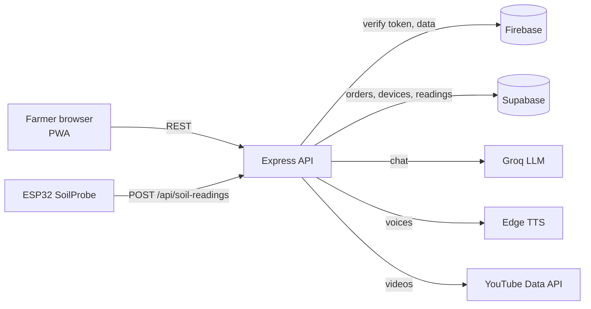

<div align="center">

# 🌾 Hardini: Chandigarh University Project

### Technology meets farming. The Chandigarh University project edition of the Hardini agri-platform.

Crop advice in your own language, live mandi prices, soil data, farming reels, a supply-chain view and instant alerts, all in one installable web app. This repository is the Chandigarh University project snapshot; the main, most complete codebase is [hardini](https://github.com/HarshCoder1122/hardini).

[](https://developer.mozilla.org/docs/Web/JavaScript)
[](https://nodejs.org/)
[](https://firebase.google.com/)
[](https://groq.com/)
[](https://livekit.io/)
[](https://vercel.com/)
[](LICENSE)

[](https://github.com/HarshCoder1122/chandigarhuniversityproject/stargazers)
[](https://github.com/HarshCoder1122/chandigarhuniversityproject/commits/main)
[](https://github.com/HarshCoder1122/chandigarhuniversityproject/issues)

</div>

## Table of contents

- [Why](#why)
- [Features](#features)
- [Architecture](#architecture)
- [Tech stack](#tech-stack)
- [Getting started](#getting-started)
- [Environment variables](#environment-variables)
- [SoilProbe IoT (ESP32)](#soilprobe-iot-esp32)
- [API reference](#api-reference)
- [Project structure](#project-structure)
- [Deployment](#deployment)
- [Security notes](#security-notes)
- [Roadmap](#roadmap)
- [Contributing](#contributing)
- [License](#license)

## Why

Most farmers have a phone but not an agronomist. Advice is slow, generic, and rarely in their own language. Hardini puts an agriculture-only AI assistant that answers in the farmer's language (in native script), real sensor data from their field, and a market and community layer into one app that works on low-end phones.

## Features

| | |
|---|---|
| **Hardini AI chat** | Groq-hosted LLM restricted to agriculture, gardening, rural development and weather. Replies in the language you pick, in native script. Accepts photos of crops. |
| **Voice replies** | Neural text-to-speech (Edge TTS) with voices mapped per Indian language, so answers can be heard, not just read. |
| **SoilProbe IoT** | Soil-moisture and temperature readings from an ESP32 probe are stored and shown per device. |
| **Alerts** | Push farm and weather alerts to users. |
| **Farming reels** | Instagram-style, autoplaying farming videos fetched through the YouTube Data API. |
| **Mandi prices** | Live market-price lookup through `/api/mandi`. |
| **Voice agents** | Real-time voice sessions through an IndusLabs LiveKit proxy (`/api/agents`, `/api/livekit`). |
| **Orders** | Place and list marketplace orders. |
| **Supply chain** | Track produce from farm to buyer. |
| **Connect** | Network with fellow farmers and mentors. |
| **Auth** | Sign in with Firebase Authentication; the backend verifies each request. |
| **PWA** | Web manifest and service worker for an install-to-home-screen experience. |

## Architecture



## Tech stack

| Layer | Technology |
|---|---|
| Frontend | HTML5, CSS3, vanilla JavaScript (single-page views), service worker |
| Backend | Node.js, Express, Axios, `ws` |
| Auth and data | Firebase (Auth, Realtime Database rules), Supabase |
| AI and speech | Groq chat completions, `edge-tts-universal`, `google-tts-api` |
| IoT | ESP32 soil probe (see the setup guide) |
| Hosting | Vercel |

## Getting started

### Prerequisites

- Node.js 18+ and npm
- Python 3 (only used to serve the static frontend in development)

### Install and run

```bash
git clone https://github.com/HarshCoder1122/chandigarhuniversityproject.git
cd chandigarhuniversityproject
npm run install:all
npm start
```

| Service | URL |
|---|---|
| Frontend | http://localhost:8080 |
| Backend | http://localhost:3001 |
| Health check | http://localhost:3001/api/health |

Other useful commands:

```bash
npm run backend       # API only
npm run backend:dev   # API with nodemon hot reload
npm run frontend      # static frontend only
```

## Environment variables

Create `backend/.env`:

```env
PORT=3001
YOUTUBE_API_KEY=your_youtube_data_api_key
INDUSLABS_API_KEY=your_induslabs_key
DATA_GOV_IN_API_KEY=your_data_gov_in_key
GROQ_API_KEY=your_groq_api_key
FIREBASE_SERVICE_ACCOUNT=<service-account JSON, or the same JSON base64-encoded>
```

Add your Supabase URL and key if you use the orders and device tables. `/api/mandi` reads prices from [data.gov.in](https://data.gov.in/). Never commit `.env` or a service-account file; both are already in [.gitignore](.gitignore).

Firebase web configuration for the client lives in [firebase-config.js](firebase-config.js). Web API keys are identifiers, not secrets, but you must restrict them in the Firebase console and enforce access with [database.rules.json](database.rules.json).

## SoilProbe IoT (ESP32)

The [ESP32 Setup Guide](ESP32_SETUP_GUIDE.md) covers a soil probe that reads soil moisture, soil temperature, ambient temperature and humidity and posts them to the backend. The full firmware lives in the main [hardini](https://github.com/HarshCoder1122/hardini) repository.

## API reference

| Method | Endpoint | Description |
|---|---|---|
| `GET` | `/api/health` | Service health |
| `GET` | `/api/reels?limit=N` | Farming videos from YouTube |
| `POST` | `/api/chat` | Hardini AI reply (`message`, `language`, `image`, `history`, `location`) |
| `POST` | `/api/tts` | Text to speech audio |
| `POST` | `/api/alerts` | Send an alert |
| `GET` | `/api/mandi` | Market (mandi) prices |
| `POST` | `/api/livekit`, `/api/agents` | Real-time voice session and agent dispatch |
| `POST` / `GET` | `/api/orders` | Create and list marketplace orders |
| `POST` / `GET` | `/api/devices` | Register and list IoT devices |
| `POST` | `/api/soil-readings` | Ingest a sensor reading |
| `GET` | `/api/soil-readings/:deviceId` | Readings for a device |

Requests other than health and public content are authenticated with a Firebase ID token.

## Project structure

```text
chandigarhuniversityproject/
├── index.html, app.js, app.css     # Main single-page app
├── login.html, hardini-auth.*      # Authentication UI and logic
├── service-worker.js, manifest.json
├── firebase-config.js, database.rules.json
├── backend/                        # Express API (server.js)
├── api/                            # Vercel serverless functions
├── ESP32_SETUP_GUIDE.md
└── vercel.json
```

## Deployment

The repo is set up for [Vercel](https://vercel.com/) ([vercel.json](vercel.json)); deploy the frontend and `backend/` and add the environment variables in the project settings. The backend is also a plain Express app and runs on any Node host.

## Security notes

- Keep every API key in environment variables. If a key has ever been committed, rotate it.
- Restrict Firebase and Google API keys by domain or API in their consoles.
- Report vulnerabilities privately; see [SECURITY.md](SECURITY.md).

## Roadmap

- [ ] Remove hardcoded fallback keys from source
- [ ] Add automated tests for the API
- [ ] Offline mode for chat history and cached advice
- [ ] Crop-disease detection from photos
- [ ] More regional languages and voices

## Contributing

Contributions are welcome, especially language support and sensor integrations. Please read [CONTRIBUTING.md](CONTRIBUTING.md) and follow the [Code of Conduct](CODE_OF_CONDUCT.md).

## License

Released under the [MIT License](LICENSE).

<div align="center"><sub>Built by <a href="https://github.com/HarshCoder1122">Harsh</a> for the people who feed us.</sub></div>
